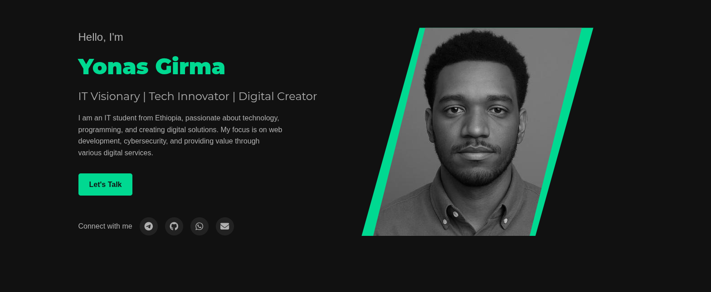

✨ Yonas Girma's Portfolio
Welcome to my corner of the web! This repository contains the source code for my personal portfolio, a digital showcase of my skills, projects, and passion for technology. Designed to be both elegant and functional, this website serves as a central hub for anyone looking to learn about my work as an IT Visionary, Tech Innovator, and Digital Creator.

🚀 Live Website
Experience the portfolio firsthand by visiting the live deployment.

URL: https://yonasgr.onrender.com/

🎨 Visual Preview
Here is a glimpse of the website's clean and modern design.

⚙️ Key Features
Responsive Design: A seamless viewing experience on desktops, tablets, and mobile devices.

Dynamic Animations: Smooth, scroll-triggered animations created with JavaScript to bring the page to life.

Contact Form: A fully functional "Get in Touch" form integrated with a custom backend to ensure direct communication.

Project Showcase: Dedicated sections to highlight my most important projects and channels.

💻 Tech Stack
Frontend: HTML5, CSS3, JavaScript

Styling: Custom CSS

Animations: Vanilla JavaScript with Intersection Observer API

Backend: Node.js, Express.js

Deployment: Render

🤝 Let's Connect
Feel free to reach out to me! I'm always open to discussing new opportunities, collaborations, or just sharing ideas.

Telegram: https://t.me/x_Jonah

GitHub: https://github.com/YonasGr

WhatsApp: https://wa.me/qr/DIDRTHI6OTDDB1

Email: yonasGirma222@gmail.com

